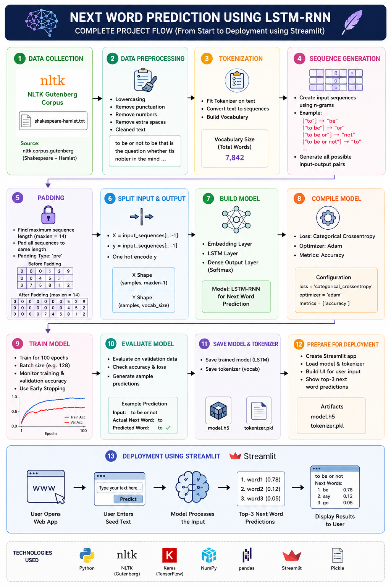
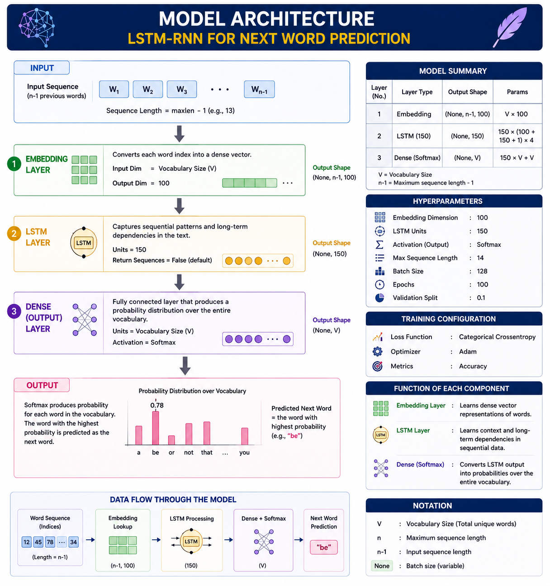

# 🧠 Next Word Prediction using LSTM-RNN

## 📌 Project Overview

This project implements a **Next Word Prediction System** using **Deep Learning** and **Natural Language Processing (NLP)** techniques. The model is trained on **Shakespeare's Hamlet** from the NLTK Gutenberg Corpus and learns contextual relationships between words to predict the most probable next word in a sequence.

The project demonstrates the complete NLP pipeline including:

* Text preprocessing
* Tokenization
* Sequence generation
* Deep Learning using LSTM-RNN
* Model training and evaluation
* Streamlit deployment for real-time predictions

---

## 🚀 Features

* Next word prediction using Deep Learning
* Shakespeare Hamlet corpus from NLTK Gutenberg
* Text preprocessing and cleaning
* Sequence generation using N-Grams
* Word embeddings for semantic representation
* LSTM-based language modeling
* Streamlit web application
* Real-time predictions

---

## 📂 Dataset

Dataset Used: **Shakespeare's Hamlet**

Source:

```python
from nltk.corpus import gutenberg

text = gutenberg.raw('shakespeare-hamlet.txt')
```

### Dataset Characteristics

* Literary text corpus
* Rich vocabulary
* Contextual sentence structures
* Thousands of sequential word patterns

The corpus is obtained from the NLTK Gutenberg collection and serves as the training data for the language model.

---

## 🔄 Complete Project Workflow

<p align="center">
  
</p>

### Workflow Summary

#### 1. Data Collection

* Load Hamlet corpus from NLTK Gutenberg.

#### 2. Text Preprocessing

* Convert text to lowercase
* Remove punctuation
* Remove special characters
* Remove extra spaces

#### 3. Tokenization

* Convert words into numerical representations.
* Build vocabulary dictionary.

#### 4. Sequence Generation

Generate input-output pairs using N-Gram sequences.

Example:

```text
Input           Output

to              be
to be           or
to be or        not
```

#### 5. Padding

* Pad sequences to equal length.
* Maximum sequence length = 14

#### 6. Split Input and Output

```python
X = input_sequences[:, :-1]
y = input_sequences[:, -1]
```

#### 7. Build Model

* Embedding Layer
* LSTM Layer
* Dense Output Layer

#### 8. Train Model

* Learn contextual word relationships.

#### 9. Save Model

```text
model.h5
tokenizer.pkl
```

#### 10. Deploy with Streamlit

Provide real-time next-word predictions through a web interface.

---

## 🏗️ Model Architecture

<p align="center">
  
</p>

### Architecture Flow

```text
Input Sequence
      │
      ▼
Embedding Layer
      │
      ▼
LSTM Layer (150 Units)
      │
      ▼
Dense Layer
      │
      ▼
Softmax Activation
      │
      ▼
Next Word Prediction
```

### Architecture Summary

```python
model = Sequential([
    Embedding(total_words, 100),
    LSTM(150),
    Dense(total_words, activation='softmax')
])
```

---

## 📊 Layer Description

### Embedding Layer

```python
Embedding(total_words, 100)
```

Purpose:

* Converts word indices into dense vector representations.
* Captures semantic relationships between words.
* Reduces sparsity of textual data.

---

### LSTM Layer

```python
LSTM(150)
```

Purpose:

* Learns sequential patterns.
* Maintains long-term contextual information.
* Captures dependencies between words.

---

### Dense Output Layer

```python
Dense(total_words, activation='softmax')
```

Purpose:

* Generates probability distribution over the vocabulary.
* Predicts the most likely next word.

---

## 📊 Training Details

| Parameter               | Value                    |
| ----------------------- | ------------------------ |
| Embedding Dimension     | 100                      |
| LSTM Units              | 150                      |
| Maximum Sequence Length | 14                       |
| Batch Size              | 128                      |
| Epochs                  | 100                      |
| Optimizer               | Adam                     |
| Loss Function           | Categorical Crossentropy |
| Metric                  | Accuracy                 |

---

## ⚙️ Why These Choices?

### Softmax Activation

Used because next-word prediction is a multiclass classification problem where the model predicts one word from the entire vocabulary.

### Categorical Crossentropy

Used because the target words are one-hot encoded.

### Adam Optimizer

Provides:

* Faster convergence
* Adaptive learning rate
* Stable training performance

### Accuracy Metric

Measures the percentage of correctly predicted next words.

---

## 📈 Results

The model successfully learns contextual patterns from Shakespeare's Hamlet and predicts the most probable next word based on the given input sequence.

### Example

Input:

```text
to be or not to be
```

Prediction:

```text
considered
```

---

## 🌐 Deployment

The model has been deployed using **Streamlit** for real-time predictions.

### Features of the Web App

* Interactive user interface
* Real-time prediction
* Fast inference
* Easy accessibility

### Demo

```text
https://your-streamlit-app-url.streamlit.app/
```

---

## 📥 Installation

Clone the repository:

```bash
git clone 
```

Install dependencies:

```bash
pip install -r requirements.txt
```

Run the application:

```bash
streamlit run app.py
```

---

## 📁 Project Structure

```text
Next-Word-Prediction-LSTM/
│
├── app.py
├── train.py
├── model.h5
├── tokenizer.pkl
├── requirements.txt
├── README.md
│
├── images/
│   ├── project_flow.png
│   └── model_architecture.png
│
└── notebooks/
    └── training.ipynb
```

---

## 🛠️ Technologies Used

* Python
* TensorFlow / Keras
* NLTK
* NumPy
* Pandas
* Streamlit
* Pickle
* Git & GitHub

---

## 🔮 Future Improvements

* Bidirectional LSTM
* GRU Networks
* Attention Mechanism
* Transformer-based Language Models
* Top-K Word Predictions
* Sentence Completion System

---

## 🎯 Conclusion

This project demonstrates how LSTM-based language models can effectively learn contextual patterns from textual data and generate meaningful next-word predictions. By combining NLP preprocessing, deep learning techniques, and Streamlit deployment, the project provides an end-to-end solution for language modeling and word prediction.

---


